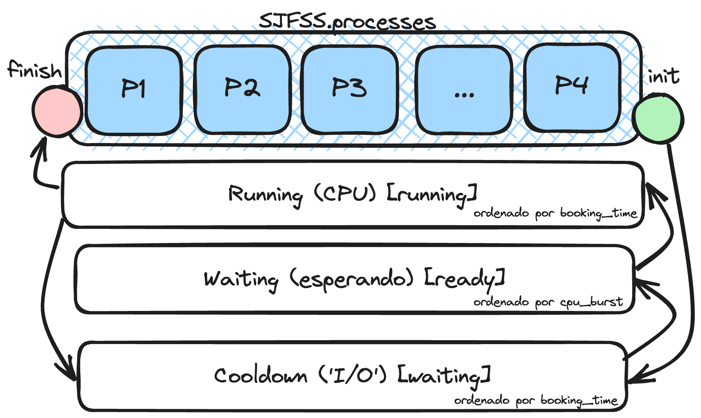

# Shortest Job First Signaling Scheduler (SJFSS)

## Overview

This project simulates the execution of a Shortest Job First Signaling Scheduler (SJFSS) for managing a set of parallel processes in a single CPU environment. It leverages system calls to handle the lifecycle of processes, including scheduling, execution, and handling interrupts.



## Objectives

The main objectives of this assignment are to:

- Model and simulate the execution of a scheduling algorithm for parallel processes.
- Utilize system calls (syscalls) to create a program that manages the lifecycle of a set of processes.
- Implement the SJFSS, which prioritizes processes based on their CPU burst times.

## Context

The scheduler is a critical component of an operating system, determining which processes to execute on the CPU. Efficient scheduling can significantly enhance system performance and responsiveness. This assignment focuses on simulating a real-world scheduler, allowing for the management of multiple processes and providing insights into their execution times and states.

## Requirements

To run this project, you need:

- A Unix-like environment (Linux, macOS, etc.)
- A C compiler (e.g., `gcc`)

## How to Run

1. Clone this repository to your local machine:

   ```bash
   git clone https://github.com/yourusername/repo.git
   cd repo
    ```

2. Compile the program:

    ```bash
    make
    ```

3. Move to the examples directory and run the tests:

    ```bash
    cd examples
    make
    ```

4. Run the program with the input file:

    ```bash
    ./sjfss examples/inputs/test[i].txt output.txt
    ```

    To run with multicore support, use the following command:

    ```bash
    ./sjfss input.txt output.csv --multicore
    ```

## Input File Format

The input file should start with the number of processes K, followed by K lines detailing each process as follows:

- `n_processes`: The number of processes to simulate.
- `PROCESS_ID`: The unique identifier of the process.
- `TIME_START`: The time at which the process arrives in the system.
- `CPU_BURST`: The CPU burst time required by the process.
- `IO_BURST`: The I/O burst time required by the process.
- `PATH`: The path to the executable file.
- `ARGC`: The number of arguments to pass to the executable.
- `ARG1 ARG2 ... ARGn`: The arguments to pass to the executable.

*Example:*

```txt
n_processes
PROCESS1 1 30 20 ./process1 3 arg1 arg2 arg3
PROCESS2 13 40 10 ./process2 1 arg1
PROCESS3 5 20 60 ./process3 2 arg1 arg2
```

## Output File Format

Upon completion, the program generates an output csv file containing the following statistics for each process:

```csv
name_proc_i,pid_i,cpu_turns_i,turnaround_time_i,resp_time_i,wait_time_i,ext_code_i
```
